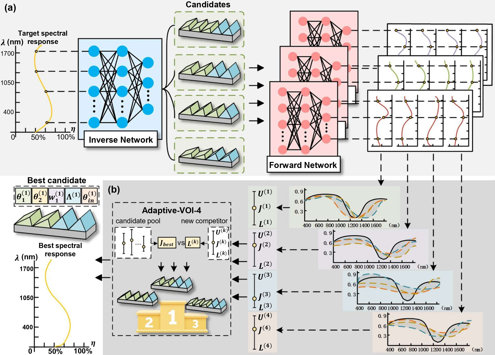

# Complete inverse-design pipeline

This folder is the standalone main project for the grating workflow:

```text
target efficiency curve
        │
        ▼
four-candidate inverse network
        │  four normalized structures
        ▼
three-seed forward ensemble
        │  mean spectrum + uncertainty
        ▼
objective-space Adaptive-VOI-4
        │  variable 1–4 RCWA calls
        ▼
low-budget selection + high-resolution final verification
```

## Complete architecture



The bundled checkpoints and data are copied into this folder. No import from the
original experiment directories is required. The active training configuration
uses the 2000-sample dataset. Older datasets and intermediate runs are kept
outside this directory and are not part of the current paper pipeline.

## Quick start

From this folder:

```powershell
python run_pipeline.py run --target-name flat_0p30 --rcwa-mode dry-run
```

This exercises the complete neural-network and decision-flow wiring without
starting MATLAB. Results are written to `outputs/complete_run/`.

To run the actual TE/Al Rakić RCWA solver:

```powershell
python run_pipeline.py run --target-name flat_0p30 --rcwa-mode matlab `
  --matlab-executable E:\MATLAB2021\bin\matlab.exe
```

The MATLAB implementation and the Rakić material table are included under
`matlab/` and `data/materials/`. The low-budget queries use order 15 and 50
layers; the final winner is rechecked with order 20 and 80 layers. Change these
with `--low-order`, `--low-layers`, `--high-order`, and `--high-layers`.

## Training from the bundled 2000-sample dataset

The checked-in forward ensemble can be used immediately. To retrain it:

```powershell
python run_pipeline.py train-forward
python run_pipeline.py train-inverse
python run_pipeline.py run
```

The normalization contract is deliberately explicit: all five physical inputs
are mapped to [0, 1], including incidence angle; efficiency spectra remain in
their original [0, 1] scale. The inverse network emits four normalized
structures, which are then converted to the physical columns expected by the
MATLAB RCWA solver.

## Folder contents

- `run_pipeline.py`: one entry point for training, inference, selection and RCWA.
- `src/`: model definitions, data loading, training, inference, RCWA adapter and
  objective-space Adaptive-VOI-4 policy.
- `data/`: active 2000-sample dataset, prescribed target curves and material
  table.
- `checkpoints/forward_ensemble_2000/`: three forward members trained on the
  active 2000-sample dataset.
- `checkpoints/inverse/seed_101_2000/`: four-candidate inverse checkpoint
  trained against the 2000-sample forward ensemble.
- `matlab/`: self-contained TE/Al RCWA functions.
- `tests/`: smoke checks for checkpoint loading, tensor shapes and policy budget.

## Scope and reproducibility note

The Python side is fully runnable from this folder. Actual RCWA calls require a
licensed MATLAB installation because the formal experiment uses the included
MATLAB implementation. If MATLAB is unavailable or its license is not valid,
use `--rcwa-mode dry-run` to verify the complete software flow, but do not report
that run as a physical RCWA result.

## License

The original source code is licensed under the MIT License.
See [LICENSE](LICENSE) for details.

Third-party materials retain their original licenses.
